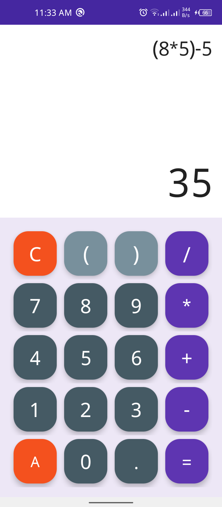
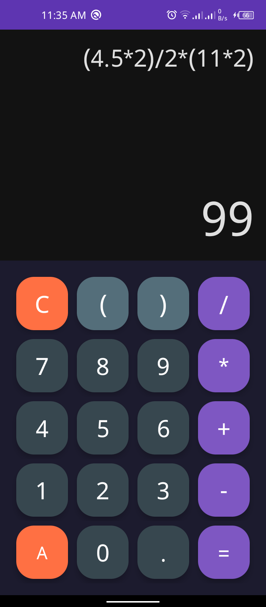

# Task 3: Calculator App

## 📖 Description
A fully functional calculator Android application developed as part of the Oasis Infobyte Student Internship Program (OIBSIP). This app provides basic arithmetic operations and evaluates mathematical expressions with proper operator precedence.

## 🎯 Features
- ✅ Number buttons (0–9) and decimal point
- ✅ Operator buttons: +, −, ×, ÷
- ✅ Bracket support for controlling expression precedence
- ✅ Equals (=) button to evaluate the full expression
- ✅ Clear (C) button to delete last character
- ✅ All Clear (AC) button to reset
- ✅ Real-time result preview as expression is typed
- ✅ Error handling (e.g., invalid expressions show "Err")

## 📸 Screenshots
| Screenshot 1 | Screenshot 2 |
|:---:|:---:|
|  |  |

## 🛠️ Tech Stack
- **Language:** Java
- **IDE:** Android Studio
- **Min SDK:** API 23
- **Expression Evaluation:** Mozilla Rhino JavaScript Engine
- **Layout:** ConstraintLayout + MaterialButton

## 🚀 How to Run
1. Clone: `git clone https://github.com/fahad11560/OIBSIP.git`
2. Open `Android-Task3-Calculator` folder in Android Studio
3. Build and run on emulator or physical device

## 📹 Demo Video
▶️ [Watch Demo on LinkedIn](https://www.linkedin.com/posts/fahadbaig15_oasisinfobyte-androiddev-androiddeveloper-activity-7494013526475243520-xmpw?utm_source=share&utm_medium=member_desktop&rcm=ACoAAGq0th4BSykRKbRa28Iy_0RpFfA8QPz32bs)

## 👤 Author
**Mirza Fahad Baig**
- Internship: Oasis Infobyte (AICTE)
- Track: Android App Development
- GitHub: [fahad11560](https://github.com/fahad11560/OIBSIP)
