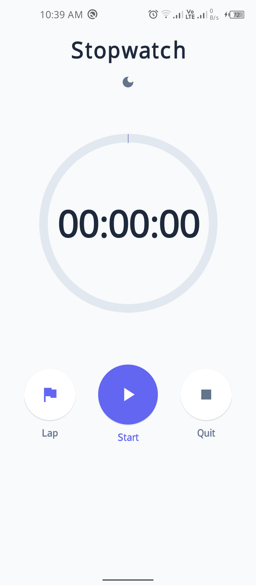
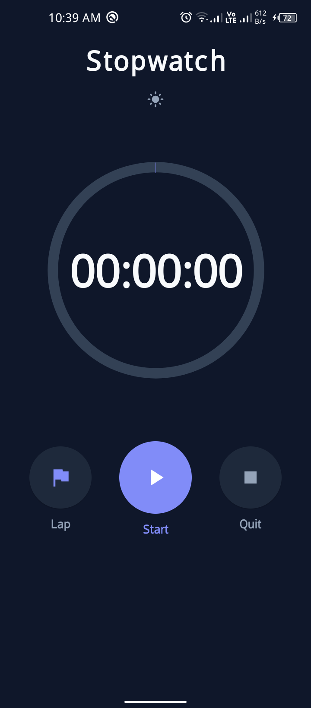
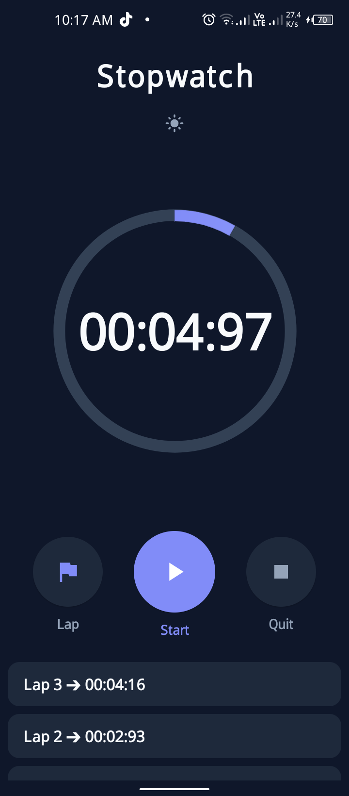

# Task 5: Stopwatch App

## 📖 Description
A beautiful, functional stopwatch Android application developed as part of the Oasis Infobyte Student Internship Program (OIBSIP). Accurately tracks elapsed time using Android's `Handler` and `SystemClock`, with full lifecycle management.

## 🎯 Features
- ✅ Large, clearly visible time display in HH:MM:SS format
- ✅ Start button: begins the timer from 0 or from paused state
- ✅ Stop/Pause button: freezes the timer at current elapsed time
- ✅ Reset button: stops and resets the display to 00:00:00
- ✅ Buttons change visual state based on timer status (active/inactive)
- ✅ Timer continues correctly if user navigates away and returns (onPause/onResume lifecycle)
- ✅ **Bonus** — Lap functionality: records current time to a scrollable list below the display
- ✅ **Dynamic Theming:** Seamlessly switches between Light and Dark modes based on system preferences
- ✅ **Custom UI:** Features a high-resolution custom neon icon scaled natively using mipmap

## 📸 Screenshots

| Light Mode | Dark Mode | Laps & Timer Running |
| :---: | :---: | :---: |
|  |  |  |

## 🛠️ Tech Stack
- **Language:** Java
- **IDE:** Android Studio
- **Min SDK:** API 24
- **Timing:** Handler + SystemClock
- **Layout:** ConstraintLayout, MaterialButton, ScrollView

## 🚀 How to Run
1. Clone: `git clone https://github.com/fahad11560/OIBSIP.git`
2. Open `Android-Task5-Stopwatch` folder in Android Studio
3. Build and run on emulator or physical device

## 📹 Demo Video
Watch the app demo on LinkedIn:  
🔗 **[Stopwatch Demo Video & LinkedIn Post](https://lnkd.in/p/dwEQfw6j)**

## 👤 Author
**Mirza Fahad Baig**
- Internship: Oasis Infobyte (AICTE)
- Track: Android App Development
- GitHub: [fahad11560](https://github.com/fahad11560/OIBSIP)
